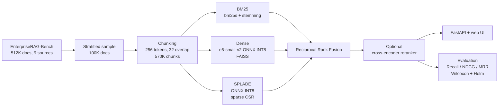

# NeedleInArXiv — Hybrid Retrieval over Enterprise Documents

**English** | [Русский](README.ru.md)

A search system for company-internal documents (Slack, Gmail, Jira, Confluence, GitHub, …) built on
[EnterpriseRAG-Bench](https://huggingface.co/datasets/onyx-dot-app/EnterpriseRAG-Bench). The project
covers the full retrieval pipeline: EDA → chunking → lexical, dense and learned-sparse retrieval → rank fusion → reranking →
statistical evaluation → a FastAPI service with a web UI.

## Highlights

- **Five retrieval methods compared on the same chunk index:** BM25 with stemming, dense
  (`intfloat/e5-small-v2` + FAISS), SPLADE (`naver/splade-cocondenser-ensembledistil`), BM25+Dense RRF
  and a **triple hybrid** (BM25 + Dense + SPLADE via Reciprocal Rank Fusion).
- **CPU-only indexing of 570K chunks:** both neural encoders were exported to ONNX and dynamically
  quantized to INT8 with `optimum`/`onnxruntime`.
- **Statistically honest evaluation:** Recall/NDCG/MRR at k ∈ {1, 5, 10, 100, 1000}, Friedman test
  plus pairwise Wilcoxon tests with Holm correction, and a breakdown by question type.
- **Found and fixed a query-ordering bug in the SPLADE pipeline:** queries were length-sorted
  before encoding, so each row of scores belonged to a different question.
- **Production-style service:** FastAPI + Qdrant + Docker Compose, 8 retrieval modes (exact/HNSW dense,
  BM25, SPLADE, hybrids), an optional cross-encoder reranker, and unit and integration tests.

## Results

Evaluated at the document level on 138 questions whose gold documents fall into the indexed sample
(see [`notebooks/04_retrieval_analysis.ipynb`](notebooks/04_retrieval_analysis.ipynb)).

| Method | Recall@10 | NDCG@10 | MRR@10 | Recall@1000 |
| --- | ---: | ---: | ---: | ---: |
| Dense (e5-small-v2, INT8 ONNX) | 0.450 | 0.371 | 0.420 | 0.667 |
| SPLADE (INT8 ONNX) | 0.567 | 0.497 | 0.557 | 0.710 |
| BM25 + stemming | 0.569 | 0.513 | 0.595 | 0.721 |
| Hybrid BM25 + Dense (RRF) | 0.565 | 0.515 | 0.605 | 0.720 |
| **Triple Hybrid BM25 + Dense + SPLADE (RRF)** | **0.599** | **0.534** | **0.616** | **0.729** |

Takeaways:

- On this corpus a strong lexical baseline beats a small dense model by a wide margin. A likely reason
  is that enterprise text is full of names, ticket IDs and product terms, which exact matching
  handles well.
- The triple hybrid is best on every metric and gives the largest candidate pool for a reranker.
  However, with n = 138 only the gaps to Dense are statistically significant (Wilcoxon + Holm,
  α = 0.05).
- Off-the-shelf cross-encoders did **not** help. `ms-marco-MiniLM-L6-v2` lowered NDCG@10 to 0.362, and
  the Jina-v3 run produced near-zero scores, so we treat it as unreliable. See notebooks 05–06.

## Architecture



## Repository structure

```text
notebooks/                    research: EDA, chunking, retrieval, analysis, reranking
  01_eda.ipynb                corpus and question statistics by source type
  02_chunking.ipynb           fixed-size vs structure-aware chunking
  03_classical_retrieval.ipynb  BM25, dense, hybrid, SPLADE indexes (ONNX INT8)
  04_retrieval_analysis.ipynb metrics@k, significance tests, per-question-type analysis
  05_reranking_minilm_bge.ipynb reranking experiments: MiniLM-L6, BGE
  06_reranking_minilm_jina.ipynb reranking experiments: MiniLM-L6, Jina-v3
  splade.py, eval_splade.py   SPLADE encoding / evaluation with the ordering fix
  *.py                        helper scripts (sampling questions, chunk coverage, tokenization)
app/                          search service
  search/                     BM25, SPLADE, Qdrant, RRF, reranker, metrics, engine
  service/                    FastAPI app, HTML/CSS/JS frontend
  scripts/                    validation, encoding, indexing, evaluation, benchmarks
  tests/                      pytest suite
  docs/                       architecture, data audit, experiment protocol
```

## Quick start

The service ships with a small demo index. It uses a hashing encoder, so it runs without
downloading any models and serves only as an infrastructure smoke test.

```bash
cd app
python -m venv .venv && source .venv/bin/activate
pip install -r requirements-dev.txt
pytest

python scripts/generate_demo_assets.py
set -a; source .env.demo; set +a
python scripts/build_bm25.py
python scripts/index_embeddings.py --iteration 1 --recreate
uvicorn service.main:app --port 8000   # UI: http://localhost:8000, API docs: /docs
```

To run on the full corpus with Qdrant in Docker, or with the precomputed indexes from the notebooks,
see [`app/README.md`](app/README.md).

## Dataset

EnterpriseRAG-Bench has 511,962 company documents from 9 source types (Slack, Gmail, Linear,
Google Drive, HubSpot, Fireflies, GitHub, Jira, Confluence) and 500 questions of eight types (basic,
semantic, project-related, completeness, constrained, intra-document reasoning, conflicting
information, miscellaneous). We indexed a 100K-document sample stratified by source type. Raw data,
indexes and model weights are not stored in git.

## Team

- **Artem Mikhailin**: research. EDA, chunking, retrieval experiments, ONNX/INT8 optimisation,
  SPLADE fix, statistical analysis and reranking.
- **[@Brevolg](https://github.com/Brevolg)**: search service. Backend, frontend, Qdrant integration
  and Docker.
