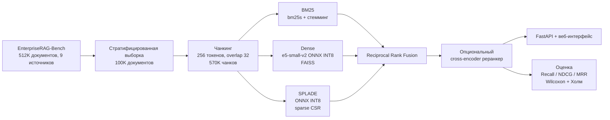

# NeedleInArXiv — гибридный поиск по корпоративным документам

[English](README.md) | **Русский**

Поисковая система по внутренним документам компании (Slack, Gmail, Jira, Confluence, GitHub, …) на
датасете [EnterpriseRAG-Bench](https://huggingface.co/datasets/onyx-dot-app/EnterpriseRAG-Bench).
Проект покрывает весь retrieval-пайплайн: EDA → чанкинг → лексический, dense и learned-sparse поиск →
слияние ранжирований → реранкинг → статистическая оценка → сервис на FastAPI с веб-интерфейсом.

## Ключевое

- **Пять методов поиска на одном чанковом индексе:** BM25 со стеммингом, dense
  (`intfloat/e5-small-v2` + FAISS), SPLADE (`naver/splade-cocondenser-ensembledistil`), гибрид
  BM25+Dense через RRF и **triple hybrid** (BM25 + Dense + SPLADE через Reciprocal Rank Fusion).
- **Индексация 570K чанков на CPU:** оба нейросетевых энкодера экспортированы в ONNX и динамически
  квантованы в INT8 через `optimum`/`onnxruntime`.
- **Честная статистическая оценка:** Recall/NDCG/MRR при k ∈ {1, 5, 10, 100, 1000}, тест Фридмана,
  попарные тесты Уилкоксона с поправкой Холма и разбивка по типам вопросов.
- **Найден и исправлен баг с порядком запросов в SPLADE:** запросы сортировались по длине перед
  кодированием, и строка скоров относилась к чужому вопросу.
- **Сервис уровня production:** FastAPI + Qdrant + Docker Compose, 8 режимов поиска (exact/HNSW dense,
  BM25, SPLADE, гибриды), опциональный cross-encoder реранкер, unit- и интеграционные тесты.

## Результаты

Оценка на уровне документов по 138 вопросам, эталонные документы которых попали в индексируемую
выборку (см. [`notebooks/04_retrieval_analysis.ipynb`](notebooks/04_retrieval_analysis.ipynb)).

| Метод | Recall@10 | NDCG@10 | MRR@10 | Recall@1000 |
| --- | ---: | ---: | ---: | ---: |
| Dense (e5-small-v2, INT8 ONNX) | 0.450 | 0.371 | 0.420 | 0.667 |
| SPLADE (INT8 ONNX) | 0.567 | 0.497 | 0.557 | 0.710 |
| BM25 + стемминг | 0.569 | 0.513 | 0.595 | 0.721 |
| Hybrid BM25 + Dense (RRF) | 0.565 | 0.515 | 0.605 | 0.720 |
| **Triple Hybrid BM25 + Dense + SPLADE (RRF)** | **0.599** | **0.534** | **0.616** | **0.729** |

Выводы:

- На этом корпусе сильный лексический baseline заметно обгоняет компактную dense-модель. Вероятная
  причина в том, что в корпоративных текстах много имён, ID тикетов и продуктовых терминов, а с ними
  хорошо справляется точное совпадение.
- Triple hybrid лучший по всем метрикам и даёт самый полный пул кандидатов для реранкера. Но при
  n = 138 статистически значимы только отличия от Dense (Wilcoxon + Холм, α = 0.05).
- Готовые cross-encoder'ы **не** помогли. `ms-marco-MiniLM-L6-v2` снизил NDCG@10 до 0.362, а прогон
  Jina-v3 дал почти нулевые скоры, поэтому мы считаем его ненадёжным. См. ноутбуки 05–06.

## Архитектура



## Структура репозитория

```text
notebooks/                    исследование: EDA, чанкинг, поиск, анализ, реранкинг
  01_eda.ipynb                статистика корпуса и вопросов по типам источников
  02_chunking.ipynb           fixed-size и structure-aware чанкинг
  03_classical_retrieval.ipynb  индексы BM25, dense, hybrid, SPLADE (ONNX INT8)
  04_retrieval_analysis.ipynb метрики@k, тесты значимости, анализ по типам вопросов
  05_reranking_minilm_bge.ipynb эксперименты с реранкингом: MiniLM-L6, BGE
  06_reranking_minilm_jina.ipynb эксперименты с реранкингом: MiniLM-L6, Jina-v3
  splade.py, eval_splade.py   кодирование и оценка SPLADE с исправленным порядком
  *.py                        вспомогательные скрипты (выборка вопросов, покрытие чанков, токенизация)
app/                          поисковый сервис
  search/                     BM25, SPLADE, Qdrant, RRF, реранкер, метрики, engine
  service/                    FastAPI, фронтенд на HTML/CSS/JS
  scripts/                    валидация, кодирование, индексация, оценка, бенчмарки
  tests/                      тесты pytest
  docs/                       архитектура, аудит данных, протокол экспериментов
```

## Быстрый запуск

В сервис входит маленький демо-индекс. Он работает на hashing-энкодере без скачивания моделей и нужен
только для проверки инфраструктуры.

```bash
cd app
python -m venv .venv && source .venv/bin/activate
pip install -r requirements-dev.txt
pytest

python scripts/generate_demo_assets.py
set -a; source .env.demo; set +a
python scripts/build_bm25.py
python scripts/index_embeddings.py --iteration 1 --recreate
uvicorn service.main:app --port 8000   # UI: http://localhost:8000, API: /docs
```

Запуск на полном корпусе с Qdrant в Docker или с готовыми индексами из ноутбуков описан в
[`app/README.md`](app/README.md).

## Датасет

EnterpriseRAG-Bench содержит 511 962 корпоративных документа из 9 типов источников (Slack, Gmail,
Linear, Google Drive, HubSpot, Fireflies, GitHub, Jira, Confluence) и 500 вопросов восьми типов (basic,
semantic, project-related, completeness, constrained, intra-document reasoning, conflicting
information, miscellaneous). Мы индексировали выборку из 100K документов, стратифицированную по типу
источника. Сырые данные, индексы и веса моделей в git не хранятся.

## Команда

- **Артём Михайлин**: исследование. EDA, чанкинг, эксперименты с поиском, ONNX/INT8-оптимизация,
  исправление SPLADE, статистический анализ и реранкинг.
- **[@Brevolg](https://github.com/Brevolg)**: поисковый сервис. Бэкенд, фронтенд, интеграция с Qdrant
  и Docker.
