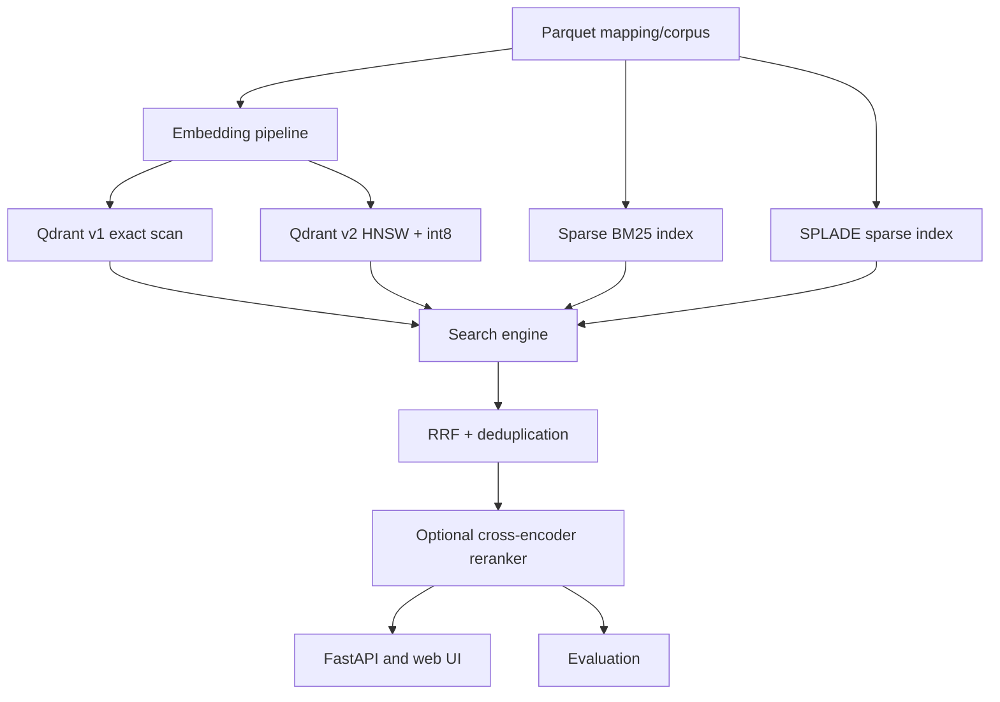

# Архитектура

## Инвариант идентификаторов

Строка `i` в mapping соответствует строке `i` в `.npy` и числовому point ID `i` в Qdrant.
`doc_id` хранится в payload и используется в qrels и финальной дедупликации. Такой дизайн
корректно обрабатывает четыре повторяющихся `doc_id` без сдвига матрицы.

## Режимы

| Режим | Dense | Sparse | Слияние | Назначение |
| --- | --- | --- | --- | --- |
| `dense_v1` | exact cosine | — | — | baseline без ANN-ошибки |
| `dense_v2` | HNSW cosine | — | — | низкая latency на масштабе |
| `bm25` | — | BM25 | — | лексический baseline |
| `splade` | — | SPLADE | — | learned sparse baseline |
| `hybrid_v1` | exact | BM25 | RRF | честная проверка ценности гибрида |
| `hybrid_v2` | HNSW | BM25 | RRF | итоговый production-подобный режим |
| `triple_hybrid_v1` | exact | BM25 + SPLADE | RRF | максимальный recall candidate pool |
| `triple_hybrid_v2` | HNSW | BM25 + SPLADE | RRF | production-подобный triple retrieval |

Exact v1 вызывает Qdrant с `exact=True`, то есть обходит HNSW и выполняет полный просмотр.
HNSW v2 использует настраиваемый `ef_search`. RRF не требует сопоставлять несравнимые шкалы
BM25, SPLADE и cosine.

## SPLADE ordering

SPLADE строит sparse-матрицу после сортировки текстов по длине. Поэтому backend сохраняет
`row_indices.npy`: строка `i` в `matrix.npz` соответствует исходной строке
`row_indices[i]` в mapping. Запросы кодируются без сортировки (`sort_by_length=False`), чтобы
строка query-матрицы не смещалась относительно текста запроса. Это повторяет фикс из
`notebooks/eval_splade.py`.

## Reranker

Reranker не участвует в первом этапе retrieval. Если `RERANKER_ENABLED=true` и запрос API
передаёт `rerank=true`, backend берёт candidate pool выбранного режима, например
`triple_hybrid_v1`, и пересортировывает его cross-encoder моделью.
